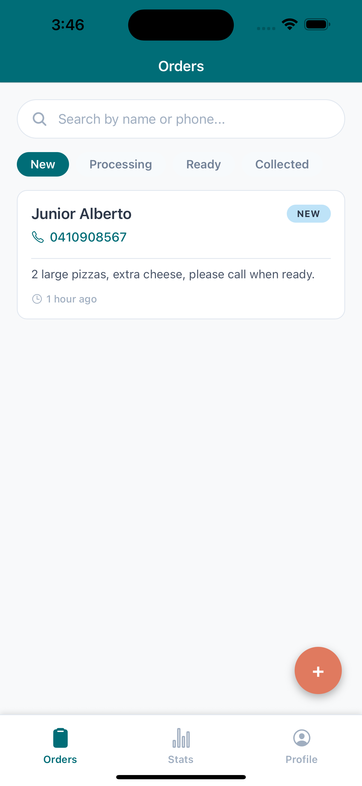
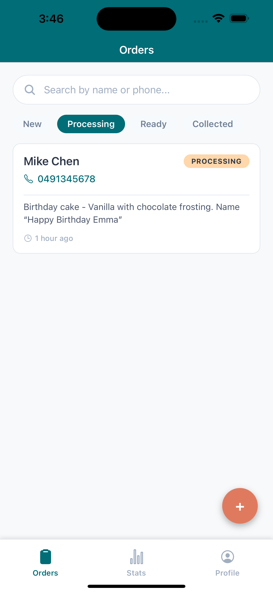
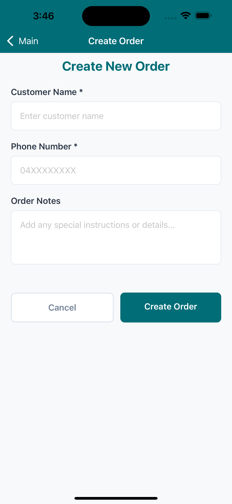
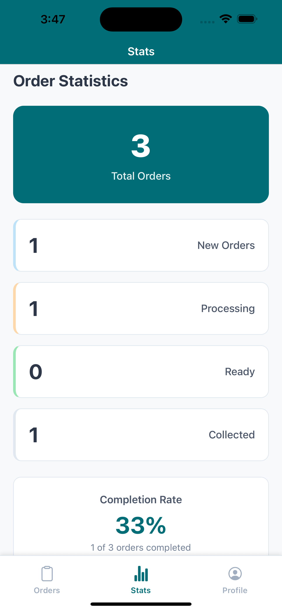

# OrderFlow - Digital Order Management System

A React Native mobile application for managing customer orders in small businesses, with real-time updates and intuitive status tracking.

## Overview

OrderFlow is a **mobile-first digital order management system** designed specifically for small businesses like cafés, bakeries, and boutiques. It replaces traditional paper-based order tracking with a modern, real-time digital solution.

## Key Features

### **Four-Stage Order Workflow**
- **New** (Blue) - Requires immediate attention
- **Processing** (Amber) - Currently being prepared  
- **Ready** (Green) - Awaiting customer pickup
- **Collected** (Gray) - Transaction completed

### **Mobile-Optimized Interface**
- **Real-time Synchronization** - Instant updates across all devices
- **Type-ahead Search** - Find orders by customer name or phone number
- **Tab-based Filtering** - Quick access to orders by status
- **Card-based Design** - Clean, scannable order display
- **Touch-friendly Controls** - 44px minimum touch targets

### **Professional Features**
- **Firebase Authentication** - Secure staff login system
- **Order History Tracking** - Complete audit trail of status changes
- **Offline Capability** - Works without internet, syncs when reconnected
- **Statistics Dashboard** - Business analytics and completion rates

## Tech Stack

- **Frontend**: React Native with Expo
- **Language**: TypeScript
- **Backend**: Firebase (Authentication + Firestore)
- **Navigation**: React Navigation v6
- **Development**: Expo CLI

## Installation

### Prerequisites

- Node.js (v18 or higher)
- npm or yarn
- Expo CLI (`npm install -g expo-cli`)
- iOS Simulator (macOS) or Android Emulator

### Setup

1. **Clone the repository**
   ```bash
   git clone https://github.com/your-username/OrderFlow.git
   cd OrderFlow
   ```

2. **Install dependencies**
   ```bash
   npm install
   ```

3. **Configure Firebase**
   - Create a new Firebase project at [console.firebase.google.com](https://console.firebase.google.com)
   - Enable Authentication (Email/Password)
   - Create Firestore database
   - Copy your config from Project Settings > General > Your apps
   - Update `src/config/firebase.ts` with your Firebase configuration

4. **Start the development server**
   ```bash
   npx expo start
   ```

5. **Run on device**
   - **iOS**: Press `i` in terminal or scan QR code with Expo Go app
   - **Android**: Press `a` in terminal or scan QR code with Expo Go app
   - **Web**: Press `w` in terminal (limited functionality)

## Screenshots

### Orders Dashboard - New Orders


The main dashboard displays new orders with customer information, phone numbers, and order details. Orders are color-coded by status and include timestamps for efficient management.

### Orders Dashboard - Processing


Staff can easily switch between order status tabs to view orders in the processing stage. The interface maintains consistency while highlighting different order states.

### Create New Order


The order creation form features clean input fields for customer name, phone number, and order details. Form validation ensures data quality and prevents incomplete entries.

### Statistics Screen


Business analytics show order completion rates, status breakdowns, and total order counts. Real-time statistics help managers track performance and identify trends.

### Profile Screen


User profile management includes account information and logout functionality. Clean interface design maintains consistency with the overall app aesthetic.

## Design

OrderFlow follows a clean, mobile-first design with:

- **Colors**: Teal primary (#006D77), coral accents (#E07A5F), cream backgrounds (#F8F9FA)
- **Typography**: System fonts optimized for readability
- **Spacing**: 8pt grid system for consistent layouts
- **Accessibility**: WCAG AA compliance with 44pt minimum touch targets

## Project Structure

```
OrderFlow/
├── src/
│   ├── screens/          # Main app screens
│   │   ├── LoginScreen.tsx
│   │   ├── DashboardScreen.tsx
│   │   ├── AddOrderScreen.tsx
│   │   ├── OrderDetailScreen.tsx
│   │   ├── StatsScreen.tsx
│   │   └── ProfileScreen.tsx
│   ├── components/       # Reusable UI components
│   │   └── OrderCard.tsx
│   ├── context/         # React context providers
│   │   └── AuthContext.tsx
│   ├── navigation/      # Navigation configuration
│   │   └── AppNavigator.tsx
│   ├── config/          # App configuration
│   │   └── firebase.ts
│   └── types/           # TypeScript type definitions
│       └── index.ts
├── assets/              # Images and app icons
│   ├── app_icon.png
│   ├── favicon.png
│   ├── splash_app_icon.png
│   └── [screenshots]
├── App.tsx             # Root component with navigation
├── index.ts            # App entry point
├── app.json            # Expo configuration
├── package.json        # Dependencies and scripts
├── tsconfig.json       # TypeScript configuration
└── README.md           # Project documentation
```

## Firebase Setup

### Authentication
- Email/password authentication for staff members
- Session persistence for convenience

### Firestore Collections

**Users Collection** (`users`)
```javascript
{
  id: string,
  email: string,
  displayName?: string,
  createdAt: timestamp
}
```

**Orders Collection** (`orders`)
```javascript
{
  id: string,
  customerName: string,
  phone: string,
  notes?: string,
  status: 'new' | 'processing' | 'ready' | 'collected',
  createdAt: timestamp,
  updatedAt: timestamp,
  createdBy: string,
  history: [
    {
      status: string,
      timestamp: timestamp,
      userId: string
    }
  ]
}
```

### Security Rules
```javascript
// Allow authenticated users to read/write orders
rules_version = '2';
service cloud.firestore {
  match /databases/{database}/documents {
    match /orders/{orderId} {
      allow read, write: if request.auth != null;
    }
    match /users/{userId} {
      allow read, write: if request.auth != null && request.auth.uid == userId;
    }
  }
}
```

## Development

### Available Scripts

- `npm start` - Start Expo development server
- `npm run android` - Run on Android emulator
- `npm run ios` - Run on iOS simulator
- `npm run web` - Run in web browser

### Adding New Features

1. Create new screens in `src/screens/`
2. Add navigation routes in `src/navigation/AppNavigator.tsx`
3. Update TypeScript types in `src/types/index.ts`
4. Test on both iOS and Android platforms

## Screens

- **Login**: Staff authentication
- **Dashboard**: Orders list with search and filters
- **Order Detail**: View and update individual orders
- **Add Order**: Create new customer orders
- **Profile**: User settings and logout

## Known Issues & Solutions

### TypeError: expected 'boolean' but had type 'string'
**Problem**: React Native navigation throws type errors with fontWeight styles.
**Solution**: Already fixed in codebase. Use numeric strings ('700') instead of 'bold'.

### Expo CLI Missing
**Problem**: `Cannot find module '@expo/cli'`
**Solution**: Run `npm install @expo/cli` if not already installed.

## Testing

### Manual Testing Checklist

- [ ] Login with valid/invalid credentials
- [ ] Create new orders with required fields
- [ ] Update order status (New → Processing → Ready → Collected)
- [ ] Search orders by customer name and phone
- [ ] Filter orders by status
- [ ] Edit existing order details
- [ ] Delete orders with confirmation
- [ ] Real-time updates across multiple devices

### Device Testing

- [ ] iPhone (various sizes)
- [ ] Android phone
- [ ] Tablet (iPad/Android)
- [ ] Different network conditions

## Troubleshooting

### Common Issues

**"Module not found" errors**
```bash
rm -rf node_modules package-lock.json
npm install
npx expo start --clear
```

**Firebase permission denied**
- Check Firestore security rules
- Verify user is authenticated
- Ensure Firebase config is correct

**App won't load on device**
- Ensure device and computer are on same Wi-Fi
- Try tunnel mode: `npx expo start --tunnel`
- Clear Expo cache: `npx expo start --clear`

## Contributing

Next steps for team members:

1. Create feature branches for new work
2. Test thoroughly before merging
3. Write clear commit messages
4. Update documentation as needed

## License

This project is for educational purposes as part of university coursework.

## Team

- **Yvonne Gitonga**
- **Tausif Rahman** 
- **Hui-Yo LO Wendy**

---

**Built with React Native + Expo | Group D Cross-Platform Apps 2025**
